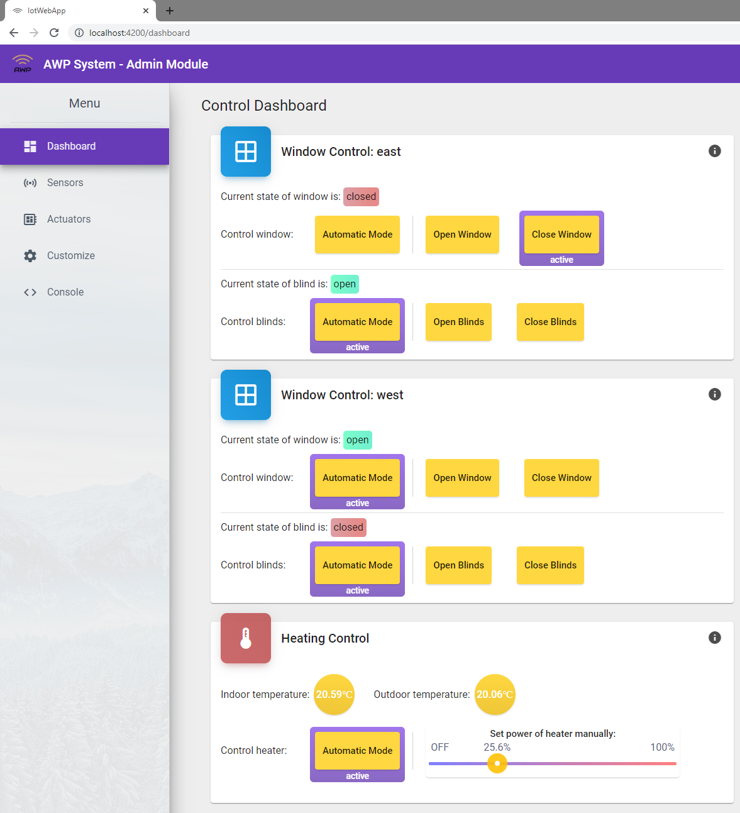

# Web App

Implementation of the Web App

## Installation
This project was generated with [Angular CLI](https://github.com/angular/angular-cli) version 12.0.2.    
To install:  
1. Install [Node.js](https://nodejs.org/en/)  
2. Run "npm install -g @angular/cli"  
3. Run "npm install" in the iot-web-app directory  

## Development server

Run `ng serve` for a dev server. Navigate to `http://localhost:4200/`. The app will automatically reload if you change any of the source files.

## Pictures

<table style="width:100%;">
  <tr valign="top">
    <td align="center">
      
    <em>Dashboard: Get information about the current system state and control actuators</em>
    </td>
  </tr>
</table>

<table style="width:100%;">
  <tr valign="top">
    <td align="center">
      
    <em>Sensors: Overview of currently connected sensors</em>
    </td>
  </tr>
</table>

<table style="width:100%;">
  <tr valign="top">
    <td align="center">
      
    <em>Actuators: Overview of the currently connected actuators</em>
    </td>
  </tr>
</table>

<table style="width:100%;">
  <tr valign="top">
    <td align="center">
      
    <em>Customize: Customize the automation to the users preferences</em>
    </td>
  </tr>
</table>

<table style="width:100%;">
  <tr valign="top">
    <td align="center">
      
    <em>Console: Mock, Test and Debug website features</em>
    </td>
  </tr>
</table>
